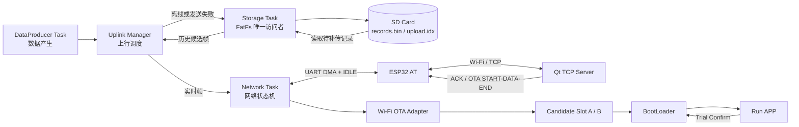
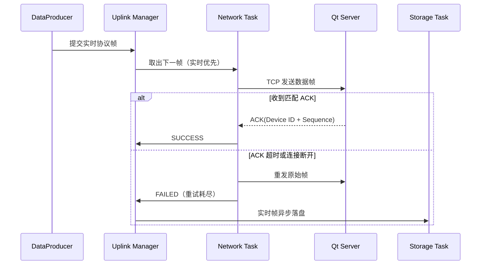

# STM32 + ESP32 可靠数据采集与 OTA 升级系统

本项目基于 **STM32F407、FreeRTOS 与 ESP32 AT 固件**，实现设备数据通过 Wi-Fi/TCP 可靠上传。系统支持 SD 卡断网缓存、网络恢复后的历史数据补传、应用层 ACK 超时重传，以及带 Trial 确认和失败回滚机制的 OTA 升级。

PC 端使用 Qt 开发 TCP 服务端，可完成设备连接管理、协议解析、数据展示、自动 ACK、重复帧识别与固件下发。


## 技术栈

- MCU：STM32F407Z 系列（Cortex-M4F）
- RTOS：FreeRTOS / CMSIS-RTOS2
- 网络模块：ESP32（ESP-AT 固件）
- 通信：UART DMA、IDLE 不定长接收、Wi-Fi、TCP
- 存储：SDIO、FatFs、Micro SD 卡
- 升级：BootLoader、候选镜像 A/B、CRC16、Trial/Confirm、Rollback
- 上位机：Qt 6、Qt Network、CMake

## 功能特性

- 基于 ESP32 AT 指令实现 Wi-Fi/TCP 建链、状态监测和分级重连。
- 使用 UART DMA 循环接收与 IDLE 事件处理不定长串口数据。
- 从 AT 响应流中提取并解析 `+IPD` TCP 数据，支持分包与粘包处理。
- 设计带 Device ID、Sequence、Timestamp 和 CRC16 的二进制应用层协议。
- 实现应用层 ACK、超时重传、重复帧幂等处理及实时数据优先调度。
- 基于 SDIO + FatFs 实现断网缓存、历史补传和上传进度恢复。
- Qt 服务端支持多连接、数据展示、自动 ACK 和 ACK 丢失测试。
- 支持通过 Wi-Fi 下发固件，完成分包写入、整包校验和版本检查。
- BootLoader 支持候选镜像安装、Trial 确认以及升级失败回滚。

## 系统架构



正常联网时，实时数据由 Uplink Manager 交给 Network Task 发送。网络不可用、实时队列已满或 ACK 重试耗尽时，数据异步写入 SD 卡。网络恢复后，Storage Task 按上传索引读取历史记录；只有收到匹配 ACK 并成功持久化新索引后，系统才继续读取下一条历史记录。

OTA 使用两个**候选镜像槽**保存固件，BootLoader 再将通过校验的候选镜像复制到统一 Run 区执行。本项目不是两个 APP 槽位原地切换运行的双 Bank 架构。

## 软件任务划分

| 任务 | 主要职责 |
| --- | --- |
| `defaultTask` | 驱动 ESP32 网络状态机、处理 TCP 收发、ACK 和 OTA 会话 |
| `DataProducerTask` | 周期产生业务数据、分配持久化 Sequence 并提交实时帧 |
| `StorageTask` | 独占 FatFs，负责记录追加、历史读取、文件校验和上传索引保存 |

将 FatFs 操作集中在 Storage Task 中，可以避免多个 FreeRTOS 任务并发操作文件对象，同时避免网络任务被 SD 卡读写长时间阻塞。

## 数据上行流程



可靠上传的关键规则：

- 同一时刻只允许一帧处于发送或等待确认状态。
- ACK 必须同时匹配当前帧的 Device ID 和 Sequence。
- ACK 等待时间为 2 秒，首次发送失败后最多额外重传 3 次。
- 重传使用同一份编码帧，不重新生成 Sequence 和 Timestamp。
- 实时帧最终失败后转存 SD 卡；历史帧失败时不推进上传索引。
- Qt 服务端以 `Device ID + Sequence` 作为幂等键；重复帧不重复计入业务，但仍回复 ACK。
- Uplink Manager 始终优先调度实时帧，再处理预读的历史候选帧。

## SD 卡存储与历史补传

SD 卡包含两个业务文件：

| 文件 | 用途 |
| --- | --- |
| `records.bin` | 以追加方式保存待补传的完整协议帧 |
| `upload.idx` | 保存下一条尚未确认记录在 `records.bin` 中的偏移 |

存储服务具备以下保护：

- 每条记录保存长度和完整协议帧，可检查边界、帧格式和 CRC。
- 能识别记录头截断、数据截断、非法长度和协议校验失败。
- `upload.idx` 使用双槽位、递增 generation 和 CRC，选择最近一份有效进度。
- 只有历史帧收到匹配 ACK 后，才提交新的上传偏移。
- 新偏移完成文件写入和 `f_sync` 后，才允许读取下一条历史记录。
- STM32 复位后重新加载上传索引，从尚未确认的位置继续补传。

## ESP32 网络状态机

网络任务按照以下状态运行：

```text
AT 检测
  -> 清理旧连接状态
  -> 设置 Station 模式
  -> 加入 Wi-Fi
  -> 查询本机 IP
  -> 建立 TCP 连接
  -> ONLINE
```

运行期间会解析 `WIFI CONNECTED`、`WIFI GOT IP`、`WIFI DISCONNECT` 和 TCP 关闭等异步事件。Wi-Fi 和 TCP 分别进入对应的重试等待状态，避免在连接失败时持续无间隔发送 AT 指令。连续 AT 检测失败后还会尝试恢复 ESP32 串口交互状态。

## 应用层协议

所有多字节字段采用大端序。帧格式如下：

| 字段 | 长度 | 说明 |
| --- | ---: | --- |
| Magic | 2 B | 固定为 `0xAA55` |
| Version | 1 B | 当前为 `0x01` |
| Message Type | 1 B | 消息类型 |
| Device ID | 4 B | 设备标识 |
| Sequence | 4 B | 业务序号或 OTA 包序号 |
| Timestamp | 4 B | 数据产生时的 RTOS Tick |
| Payload Length | 2 B | Payload 有效长度，最大 64 B |
| Payload | 0～64 B | 消息数据 |
| CRC16 | 2 B | CRC-16/CCITT-FALSE |

### 消息类型

| 消息 | Type | 方向 | 说明 |
| --- | ---: | --- | --- |
| Realtime Data | `0x01` | 设备 → 服务端 | 实时采集数据 |
| History Data | `0x02` | 设备 → 服务端 | SD 卡历史数据 |
| Heartbeat | `0x03` | 设备 → 服务端 | 协议预留 |
| Command | `0x10` | 服务端 → 设备 | 协议预留 |
| OTA START | `0x20` | 服务端 → 设备 | 声明镜像大小、CRC 和版本 |
| OTA DATA | `0x21` | 服务端 → 设备 | 固件分包数据 |
| OTA END | `0x22` | 服务端 → 设备 | 请求完成校验 |
| ACK | `0x80` | 服务端 → 设备 | 确认实时或历史数据 |
| OTA RESPONSE | `0xA0` | 设备 → 服务端 | OTA 命令执行结果 |

> `Heartbeat` 和 `Command` 当前完成了协议类型定义，不代表业务处理逻辑已经接入。

## OTA 与 BootLoader

### OTA 传输流程

1. Qt 服务端读取 `.bin` 文件并计算 CRC-16/MODBUS。
2. 服务端发送 `OTA START`，携带镜像大小、整体 CRC 和版本号。
3. 设备选择当前非活动候选槽并擦除目标区域。
4. 服务端以停等方式发送 `OTA DATA`，当前最大 Payload 为 64 字节。
5. 每个请求等待设备响应；超时后重发同一帧，最多重试 3 次。
6. 服务端发送 `OTA END`，设备检查包数、总字节数和整包 CRC。
7. 校验成功后写入 `PENDING` 标志并复位。
8. BootLoader 将候选镜像复制到 Run 区并进入 Trial 状态。
9. 新 APP 正常运行约 3 秒后写入 Confirm；未确认时由 BootLoader 执行回滚。

OTA 接收期间暂停获取新的业务上行帧，但 DataProducer 和 Storage Task 仍继续运行；实时队列无法接收的新数据沿用原有 SD 卡落盘机制。

### Flash 分区

| 区域 | 地址范围 | 大小 | 用途 |
| --- | --- | ---: | --- |
| BootLoader | `0x08000000`～`0x0800FFFF` | 64 KB | 启动、安装、Trial 与回滚 |
| Flag Copy 0 | `0x08010000`～`0x0801FFFF` | 64 KB | 升级状态及镜像元数据 |
| Run APP | `0x08020000`～`0x0805FFFF` | 256 KB | 当前执行的 APP |
| Candidate A | `0x08060000`～`0x0809FFFF` | 256 KB | 候选镜像 A |
| Candidate B | `0x080A0000`～`0x080DFFFF` | 256 KB | 候选镜像 B |
| Flag Copy 1 | `0x080E0000`～`0x080FFFFF` | 128 KB | Flag 冗余副本所在扇区 |

APP 必须链接到 `0x08020000`，且固件镜像不得超过 256 KB。

## Qt TCP 服务端

`wifi-server` 提供以下能力：

- 配置监听地址和端口，默认端口为 `8080`。
- 管理多个 TCP 连接并显示在线设备数量。
- 流式解析应用层协议，显示 Device ID、Sequence、类型、Payload 和 CRC 状态。
- 自动回复业务 ACK，也可关闭自动 ACK 以测试设备重传。
- 跨 TCP 连接保留最近 256 个 `Device ID + Sequence` 去重键。
- 选择固件文件、输入版本号并显示 OTA 下发进度。

## 工程目录

```text
WIFI-1/
├── Core/                         # STM32 APP 初始化与 FreeRTOS 任务
├── Drivers/BSP/
│   ├── data/                     # 测试数据产生与 Sequence 持久化
│   ├── esp32/
│   │   ├── driver/               # UART DMA 驱动
│   │   ├── at/                   # AT 响应解析
│   │   ├── event/                # Wi-Fi/TCP 异步事件解析
│   │   ├── tcp/                  # +IPD 数据提取
│   │   └── application/          # Wi-Fi/TCP 状态机及可靠发送
│   ├── protocol/                 # Device Protocol V1
│   ├── storage/                  # SD 卡存储服务
│   ├── uplink/                   # 实时/历史统一调度
│   ├── app_update/               # APP 侧候选镜像下载状态机
│   ├── wifi_ota/                 # Device Protocol 到升级模块的适配
│   ├── app_trial/                # APP Trial 确认
│   └── boot_confirm/             # BootLoader/APP 握手
├── Common/FirmwareUpdate/        # APP 与 BootLoader 共用升级组件
├── Boot_Loader/                  # 独立 BootLoader 工程
├── FATFS/                        # FatFs 与 SDIO 适配
├── Middlewares/                  # FreeRTOS、FatFs
├── wifi-server/                  # Qt TCP 服务端
├── WIFI-1.ioc                    # STM32CubeMX 配置
└── OTA_INTEGRATION.md            # OTA 接入和人工验证说明
```

## 硬件连接

当前 CubeMX 工程中的主要外设配置：

| 功能 | STM32 外设/引脚 |
| --- | --- |
| ESP32 串口 TX | USART3 TX / PB10 |
| ESP32 串口 RX | USART3 RX / PB11 |
| 调试串口 | USART1 / PA9、PA10 |
| SD 卡 | SDIO 4-bit / PC8～PC12、PD2 |

ESP32 通信参数为 `115200 8N1`。

## 配置说明

当前 Wi-Fi 和 TCP 服务器参数位于：

```text
Drivers/BSP/esp32/application/esp32_network.c
```

公开仓库或切换运行环境前，请将以下参数替换为自己的配置：

```c
AT+CWJAP="YOUR_WIFI_SSID","YOUR_WIFI_PASSWORD"
AT+CIPSTART="TCP","YOUR_SERVER_IP",8080
```

建议后续将这些参数集中到不提交 Git 的本地配置文件中，并提供一份不包含真实凭据的 `config.example.h`。

## 编译与运行

### STM32 APP

1. 使用 STM32CubeMX 打开 `WIFI-1.ioc` 检查外设配置。
2. 使用 Keil MDK 打开 `MDK-ARM/WIFI-1.uvprojx`。
3. 确认 APP ROM 起始地址为 `0x08020000`、最大长度为 `0x40000`。
4. 根据实际环境修改 Wi-Fi SSID、密码、服务器 IP 和端口。
5. 编译后将 APP 首次烧录到 Run 区。

### BootLoader

1. 使用 Keil MDK 打开 `Boot_Loader/MDK-ARM` 下的工程文件。
2. 编译并将 BootLoader 烧录到 `0x08000000`。
3. 首次部署时，再将 APP 烧录到 `0x08020000`。

推荐烧录顺序：

```text
BootLoader -> Run APP -> 启动 Qt 服务端 -> 设备上电
```

### Qt 服务端

需要 Qt 6.5 或更高版本，并安装 `Core`、`Widgets` 和 `Network` 组件。

```bash
cd wifi-server
cmake -S . -B build
cmake --build build
```

启动后：

1. 设置监听地址，通常使用 `0.0.0.0`。
2. 设置监听端口，默认 `8080`。
3. 点击“启动监听”。
4. 确保 ESP32 配置的服务器 IP 是运行 Qt 服务端电脑的局域网地址。
5. 设备连接后观察实时数据、Sequence、CRC 和 ACK 日志。

### 发起 OTA

1. 准备链接地址为 `0x08020000` 的 APP `.bin` 文件。
2. 确认镜像大小不超过 256 KB。
3. 保持设备在线，在 Qt 服务端点击“选择固件并 OTA”。
4. 输入高于当前固件的版本号。
5. 观察 START、DATA、END 响应和进度条。
6. 等待设备复位，并检查 BootLoader 安装与 APP Trial Confirm 日志。

## 测试建议与验证记录

下表是项目建议执行的验收项。只有实际完成并保存日志后，才应在简历或仓库中标记为“通过”。

| 测试项目 | 测试方法 | 预期结果 | 状态 |
| --- | --- | --- | --- |
| 连续运行 | 设备持续联网并周期上报 48 小时 | 无死机，数据持续上传 | 待实测记录 |
| Wi-Fi 断开恢复 | 关闭并恢复路由器或热点 | 自动重连并恢复上传 | 待实测记录 |
| TCP 服务端重启 | 关闭并重新启动 Qt 服务端 | 设备重建 TCP 连接 | 待实测记录 |
| ACK 丢失 | 关闭 Qt 自动 ACK | 设备按 2 秒超时策略重传 | 待实测记录 |
| 历史补传 | 断网产生数据后恢复网络 | 历史数据按索引补传 | 待实测记录 |
| 上传中复位 | 历史补传期间复位 STM32 | 从持久化索引恢复进度 | 待实测记录 |
| OTA 正常升级 | 下发合法固件 | 校验、安装、Trial Confirm 成功 | 待实测记录 |
| OTA 传输中断 | DATA 阶段断开 TCP | 会话超时退出，不安装残缺镜像 | 待实测记录 |
| 固件 CRC 错误 | 修改镜像或声明错误 CRC | 拒绝写入 PENDING | 待实测记录 |
| Trial 失败 | 新 APP 不执行 Confirm | BootLoader 恢复旧版本 | 待实测记录 |

建议把实测日期、固件版本、运行日志和问题记录整理到独立的 `docs/test-report.md` 中。

## 当前构建状态

- STM32 APP 端 C 文件已使用 Arm Compiler 6.16 完成编译检查。
- 当前开发环境在链接约 57.6 KB 镜像时受到 Keil 许可证代码大小限制；该问题不是 256 KB APP 分区容量超限。
- Qt `wifi-server` 已使用 Qt 6.8.3 / MinGW 13.1 构建成功。
- OTA 和异常恢复仍应以目标板实机测试结果作为最终验收依据。

## 已知限制

- Wi-Fi SSID、密码和服务器地址目前仍硬编码在网络状态机源码中。
- 当前业务数据由 DataProducer 生成固定测试值，尚未接入真实传感器。
- OTA 使用 64 字节停等分包，优先保证流程清晰和可靠性，传输效率仍可优化。
- Qt 服务端的重复帧去重窗口保存在内存中，服务端完全重启后不会保留。
- 当前上传时间戳使用 RTOS Tick，不是 RTC 或网络校准后的绝对时间。
- 多设备长时间并发能力需要进一步实测。

## 后续计划

- 将 Wi-Fi 与服务器参数迁移到独立配置模块，移除源码中的敏感信息。
- 接入真实传感器或 CAN/Modbus 数据源。
- 增加 RTC/NTP 时间同步，使用真实 Unix 时间戳。
- 增加看门狗、任务栈余量统计和运行状态监控。
- 为协议解析、ACK 重试、存储恢复和 OTA 状态机增加自动化测试。
- 保存 Qt 服务端去重状态，增强服务端重启后的幂等能力。

## 说明

更详细的 OTA 接入关系、消息格式和人工验证步骤请参阅 [`OTA_INTEGRATION.md`](OTA_INTEGRATION.md)。

